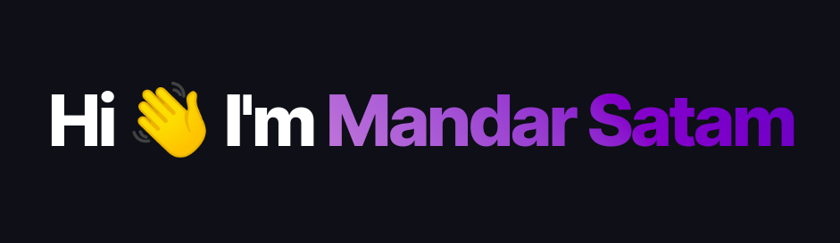

  

### Tech Stack

     

---

**Github Stats:**

  
  
  

Checkout my Portfolio here 👉🏻 [**Portfolio**](https://mandarsatam.github.io)

---

  <i>Connect with me!</i> 
   
  <i>
    
     
     
     
  </i>

